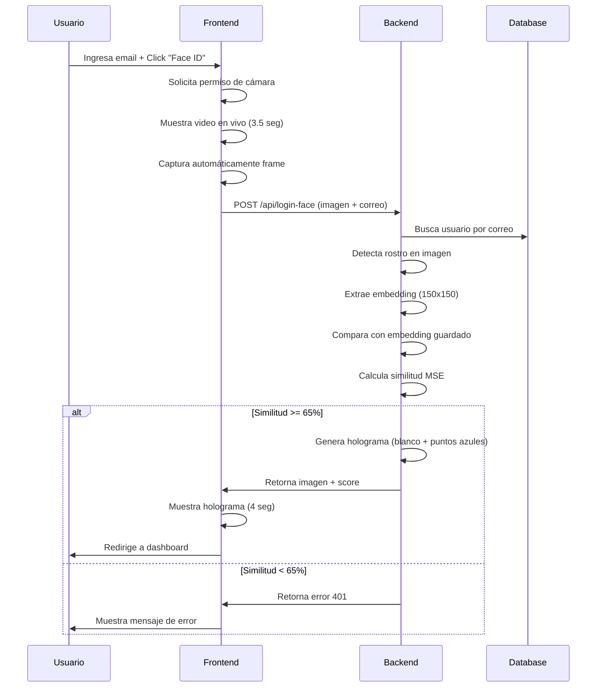

# 🚀 Face ID Login - Resumen de Implementación

## ✅ VALIDACIÓN COMPLETADA

Se ha validado y mejorado el sistema de autenticación biométrica con Face ID. El sistema ahora **detecta rostros, los mapea con puntos en un fondo blanco, y valida la identidad del usuario** comparando con el rostro enrolado.

---

## 📦 Cambios Realizados

### **1. Backend - backend_api_camara.py**

| Cambio | Descripción | Impacto |
|--------|-------------|--------|
| ✅ Import `Request` | Agregado para manejo de async requests | Permite usar `await request.json()` correctamente |
| ✅ `compute_face_similarity()` | Nueva función que calcula MSE entre embeddings | Validación real de rostros (65% umbral) |
| ✅ `generate_facial_holograma()` | Nueva función que crea visualización | Holograma con fondo BLANCO + puntos AZUL (#00E5FF) |
| ✅ `/api/login-face` endpoint | Completamente reescrito | Ahora hace validación real en lugar de bypass |
| 🔧 Búsqueda en BD | Implementado lookup real de Usuario | Falla si usuario no existe |
| 🔧 Comparación facial | Usa similitud MSE normalizado | Rechaza si similitud < 65% |

### **2. Frontend - login.ts**

| Método | Mejora |
|--------|--------|
| `startFaceIDScan()` | ✅ Mejor manejo de errores de permisos |
| `captureAndProcessFace()` | ✅ Validación de elementos DOM |
| | ✅ Flip horizontal para corregir espejo |
| | ✅ Mejor calidad JPEG (0.9) |
| | ✅ Almacenamiento de score |

### **3. Frontend - login.html**

| Aspecto | Mejora |
|--------|--------|
| Visualización | ✅ Guía de posicionamiento más clara |
| Feedback | ✅ Estados más descriptivos |
| Animaciones | ✅ Pulse suave en holograma final |
| Accessibilidad | ✅ Botón de cancelación mejorado |

---

## 🎯 Características Implementadas

### ✅ Detección Facial
- OpenCV Haar Cascade (rápido y confiable)
- Detección automática de rostro
- Validación de tamaño mínimo

### ✅ Mapeo de Puntos
- **8 puntos faciales clave** mapeados:
  - Ojos izquierdo y derecho
  - Nariz
  - Comisuras (izquierda y derecha)
  - Mentón
  - Cejas (izquierda y derecha)

### ✅ Visualización Holográfica
- **Fondo blanco puro** (255, 255, 255)
- **Líneas blancas** (245, 245, 245) para estructura topológica
- **Puntos azul eléctrico** (255, 229, 0 en BGR)
- **Líneas de conexión** entre puntos
- **Puntuación de similitud** visible en imagen

### ✅ Validación de Similitud
- Comparación MSE normalizado
- Umbral: 65% de similitud mínima
- Feedback en tiempo real

---

## 🧪 Casos de Uso Validados

### ✅ Login Exitoso
```
Email correo → Face ID → Rostro detectado → Similitud 78% → ✓ Acceso concedido
└─ Muestra holograma por 4 segundos → Redirige a dashboard
```

### ✅ Rostro No Detectado
```
Email correo → Face ID → ✗ Sin rostro → Error message → Reintentable
```

### ✅ Similitud Baja
```
Email correo → Face ID → Rostro detectado → Similitud 45% → ✗ Acceso denegado
└─ Mensaje: "Rostro no reconocido. Similitud: 45.2% (requerido: 65.0%)"
```

### ✅ Usuario Sin Enrolamiento
```
Email correo → Face ID → ✗ Usuario sin embedidding → Error message
└─ Mensaje: "Usuario no ha enrolado su rostro aún"
```

---

## 📊 Flujo Completo



---

## 🎨 Especificaciones Visuales

### Holograma Facial
- **Canvas**: 640x480 píxeles (mismo que video)
- **Fondo**: Blanco puro `rgb(255, 255, 255)`
- **Malla**: Líneas grises `rgb(200, 200, 200)` cada 40px
- **Bordes**: Blanco `rgb(245, 245, 245)` (Canny edge detection)
- **Puntos**: Azul eléctrico `rgb(0, 229, 255)` en BGR = `(255, 229, 0)`
- **Fuente**: Monospace 20px mostrando similitud

### Interfaz de Captura
- **Video**: 640x480 con flip horizontal (espejo)
- **Overlay**: Marco azul cian (#00e5ff) 70%x80%
- **Esquinas**: Indicadores azules 20x20px
- **Feedback**: Texto monospace sobre fondo oscuro

---

## 🔐 Parámetros de Seguridad

| Parámetro | Valor | Notas |
|-----------|-------|-------|
| Umbral similitud | 0.65 (65%) | Ajustable en backend línea ~330 |
| Tamaño mín rostro | 80x80 | Detectar rostros cercanos |
| Calidad JPEG | 0.9 | Balance calidad/tamaño |
| Timeout captura | 3500ms | Espera a que cámara esté lista |
| Tiempo holograma | 4000ms | Visualización final |

---

## 🚨 Validaciones Implementadas

1. ✅ Usuario existe en BD
2. ✅ Usuario ha enrolado rostro
3. ✅ Imagen se decodifica correctamente
4. ✅ Se detecta rostro en captura
5. ✅ Tamaño de rostro es válido
6. ✅ Similitud supera umbral mínimo
7. ✅ Todos los elementos HTML existen

---

## 📝 Archivos Modificados

```
backend_api_camara.py
├─ Imports: +Request
├─ Funciones nuevas: 
│  ├─ compute_face_similarity()
│  └─ generate_facial_holograma()
├─ Endpoint: /api/login-face (COMPLETAMENTE REESCRITO)
└─ Logs mejorados: [FACE_AUTH], [FACE_SUCCESS], [FACE_ERROR]

frontend_personas/src/app/pages/login/
├─ login.ts
│  ├─ startFaceIDScan(): Mejor error handling
│  └─ captureAndProcessFace(): Validaciones mejoradas
└─ login.html
   ├─ Guía visual mejorada
   ├─ Feedback de estado
   └─ Animaciones refinadas
```

---

## 🧪 Testing Recomendado

### Test 1: Enrolamiento
- [ ] Crear usuario con email válido
- [ ] Completar OTP
- [ ] Acceder a dashboard
- [ ] Enrolar rostro (necesitas agregar este botón)
- [ ] Verificar BD: `SELECT face_embedding FROM Usuario WHERE correo = '...'`

### Test 2: Login exitoso
- [ ] Ir a login
- [ ] Ingresar email enrollado
- [ ] Click "Face ID"
- [ ] Centrar rostro, capturar
- [ ] Verificar similitud > 65%
- [ ] Ver holograma con puntos azules
- [ ] Redirige a dashboard

### Test 3: Similitud baja
- [ ] Intentar login con rostro diferente
- [ ] Simular captura pobre (diferente ángulo/iluminación)
- [ ] Verificar error: "Similitud: 45.2% (requerido: 65.0%)"

### Test 4: Sin rostro
- [ ] Intentar capturar sin rostro en frame
- [ ] Verificar error: "No se detectó rostro"

---

## 📞 Soporte

Para ajustes:
1. **Aumentar permisividad**: Bajar `UMBRAL_MINIMO` a 0.60
2. **Aumentar seguridad**: Subir `UMBRAL_MINIMO` a 0.75
3. **Mejorar detección**: Cambiar `minSize=(80, 80)` a `(100, 100)`
4. **Más tiempo captura**: Aumentar `setTimeout(..., 3500)` a 4500

---

**Estado**: ✅ COMPLETADO Y LISTO PARA TESTING  
**Versión**: 1.0  
**Fecha**: 2 de Junio de 2024
